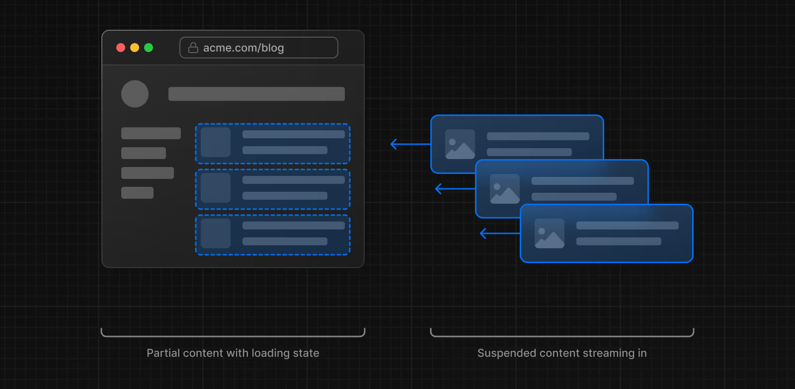

> ✅ 작성기준: Spec Check
> Next.js v15 / React 19 rc / App Routing 방식을 사용하고 있습니다.

## 문제 상황

React와 Next.js를 사용해 **클라이언트 컴포넌트에서 데이터를 패칭하기 위해 ‘use Server’로 선언된 useQuery 훅을 사용하도록 구현해보았습니다**. 서버에서 데이터를 가져오고, 클라이언트 컴포넌트에서 이를 렌더링하려고 했습니다.

### 하지만 결과는..?


그저 에러… RIP

### 에러 메시지를 읽어보자.

> Unhandled Runtime Error
>
> Error: Switched to client rendering because the server rendering errored:
>
> Server Functions cannot be called during initial render. This would create a fetch waterfall. Try to use a Server Component to pass data to Client Components instead.

> (번역. DeepL)
> 처리되지 않은 런타임 오류
>
> 오류: 서버 렌더링에 오류가 발생하여 클라이언트 렌더링으로 전환했습니다:
>
> **초기 렌더링 중에 서버 함수를 호출할 수 없습니다.** 이로 인해 **페치 워터폴**이 발생합니다. 대신 **서버 컴포넌트를 사용하여 클라이언트 컴포넌트에 데이터를 전달**해 보세요.

초기에 이 문장을 접했을 때, 동작에 대한 배경지식이 충분하지 않다면 다소 추상적으로 느껴질 수 있습니다. 그러나 배움에는 정해진 순서가 없듯, 이 문장이 동작을 이해하는 출발점이 될 수도 있습니다. 오늘은 이 에러 문장을 문장 단위로 나누어, 하나씩 이해해보는 시간을 가져보려고 합니다.

## 1. 초기 랜더링 중에 서버 함수를 호출 할 수 없다?

해당 에러 메시지에서 말하는 **initial render**는 **클라이언트 사이드 렌더링(Client-Side Rendering, CSR)을 말하는 것입니다. 즉,** 클라이언트 사이드 렌더링 중에 **서버 전용 함수(Server Functions)** 를 호출하려고 했을 때 발생하는 상황을 가리킵니다.

<aside>

📌 Next.js는 서버 전용 함수의 잘못된 호출로 인해 CSR로 자동 전환됩니다.

</aside>

<br>

**서버 전용 함수란?**

→ React 서버 컴포넌트(Server Components)에서 실행되어야 하는 함수.<br>
ex) fetch로 데이터를 가져오는 작업을 서버 컴포넌트에서 처리하거나, 서버에서만 동작하는 API 호출.

**클라이언트에서 서버 전용 함수를 호출하면?**

→ 클라이언트에서 실행되는 컴포넌트는 브라우저에서 실행되므로, 서버 전용 함수는 사용할 수 없습니다.<br>
ex) 클라이언트 컴포넌트에서 비동기 fetch를 서버 컴포넌트의 맥락처럼 호출하려고 하면 에러가 발생합니다.

## 2. 패치 워터폴(fetch waterfall)이 발생된다? (feat.streaming)

<aside>

> ‘패치 워터폴’ 이란 말그대로 fetch 동작이 직렬적 (water fall)으로 진행된다는 의미 입니다.
> 구체적으로, **렌더링과 데이터 패칭 사이의 동작이 직렬적으로 이루어지는 상황**을 지칭합니다.

</aside>

### 2-1. Next.js 의 기본적인 랜더 사이클

Next.js 에서 기본적으로 데이터 패칭 작업이 있을 경우 실행하는 사이클을 살펴보겠습니다.

하나의 컴포넌트가 화면에 표시 되기까지 대략 과정은 이러합니다.

> 데이터 fetch → 2. 서버에서 HTML 랜더링 → 3. 클라이언트에서 HTML 랜더링 → 4. 하이드레이션


### 2-2. 서버에서의 병렬적인 데이터 요청! : streaming 방식 사용을 통한 더 효율적인 SSR

Next.js 는 사용자에게 좀 더 효율적이고 빠른 페이지를 전달하기 위해 이러한 동작을 streaming 을 사용하여 client 에 전달하게 됩니다. 이로 인해 서버에서는 병렬적인 랜더, 데이터 패칭을 진행 합니다.

아래 예시를 준비했습니다.

**각기 다른 데이터를 요청하는 fetch 함수 2개**와 이 **데이터 2개를 포함하고 있는 컴포넌트**가 있습니다.

```jsx
async function 패치함수1() {
    return fetch('/api/data1').then(res => res.json());
}

async function 패치함수2() {
    return fetch('/api/data2').then(res => res.json());
}

-------------------------------

export default async function 컴포넌트() {
    const 데이터1_프로미스 = 패치함수1();
    const 데이터2_프로미스 = 패치함수2();

    const [데이터1, 데이터2] = await Promise.all([데이터1_프로미스, 데이터2_프로미스]);

    return (
        <div>
            <p>Data 1: {데이터1}</p>
            <p>Data 2: {데이터2}</p>
        </div>
    );
}
```

> streaming 을 사용하지 않는다면 “컴포넌트” 내에 있는 두 데이터 패칭이 병렬적으로 실행되고, 모두 완료가 된 다음에 페이지가 완성될 수 있으므로 그때 클라이언트에 HTML 파일을 전달할 수 있게 됩니다. **SSR 이지만 페이지가 사용자에게 표시되기 전에 서버에서 모든 데이터를 가져오는 작업이 완료되어야 하므로 여전히 느릴 수 있습니다.**

이를 해소하기 위해 스트리밍 방식을 도입하였습니다.

**스트리밍을 사용** 하면 페이지의 HTML을 작은 조각으로 나누고 점진적으로 해당 조각을 서버에서 클라이언트로 전송할 수 있습니다.



> 전체 레이아웃을 먼저 만들어 주고, 그 안에 각 요소별로 data fetching 을 요청하여 완성된(답변이 돌아온) 순서대로 컴포넌트를 클라이언트로 **스트리밍(streaming)** 하는 방식입니다.
>
> 스트리밍은 긴 데이터 요청으로 인해 페이지 렌더링이 차단되는 것을 방지하려는 경우 특히 유용합니다. 스트리밍은 [첫 번째 바이트까지의 시간(TTFB)을 줄일 수 있기 때문입니다.](https://web.dev/ttfb/)그리고 [첫 번째 콘텐츠 페인트(FCP)](https://web.dev/first-contentful-paint/). 또한 [TTI(대화 시간)를 개선하는 데 도움이 됩니다.](https://developer.chrome.com/en/docs/lighthouse/performance/interactive/)특히 느린 장치에서는 그렇습니다.

그리하여 서버에서는 아래와 같은 병렬 동작을 수행하게 됩니다.


### 2-3. 클라이언트 컴포넌트에서의 데이터 패칭

클라이언트 컴포넌트에서는 데이터 패칭이 항상 직렬적으로 이루어집니다.

클라이언트 컴포넌트 내부에서 데이터를 패칭하려면 useEffect 또는 useState와 같은 React 훅을 사용해야 합니다. 그러나 이러한 훅은 React 컴포넌트가 브라우저에서 렌더링된 이후에 실행됩니다. 다시 말해, 브라우저가 컴포넌트를 렌더링한 후에야 데이터를 가져올 수 있는 구조이며, 컴포넌트 내부의 데이터 패칭 로직은 항상 컴포넌트가 마운트된 다음에 실행됩니다.

이로 인해 클라이언트 컴포넌트의 **렌더링과 데이터 패칭이 직렬적으로 처리되는** 모습을 보이게 됩니다.

### 그러므로,

데이터 패칭이 필요한 컴포넌트가 연속적으로 이어져 있다면, 각 컴포넌트의 데이터 패칭과 렌더링이 직렬적으로 진행되므로 병렬 처리에 비해 시간이 훨씬 더 오래 걸립니다. 이는 **Next.js의 주요 장점 중 하나인 빠른 페이지 로딩 성능**을 저해할 수 있는 요소입니다. 이러한 이유로, Next.js는 이러한 동작이 문제를 일으킬 가능성이 있는 경우 경고나 에러로 이를 알려줍니다.

## 3. 해결방안: 서버 컴포넌트를 사용하여 클라이언트 컴포넌트에 데이터는 어떻게 전달하나?

이 문장은 해결 대안으로써 전달 되는 내용에 가깝습니다. 가급적 미리 데이터를 패치하고 사용하라는 권유입니다.

### 그렇다면, Next 에서 권장하는 방법은 어떻게 구현할 수 있을까요?

Next.js에서 데이터를 미리 패치하는 방법은 사용하는 **라우팅 방식**에 따라 다릅니다. **페이지 라우터(Page Router)**과 **앱 라우터(App Router)** 방식 각각에서 사용할 수 있는 패턴을 살펴보겠습니다. 여기서는 페이지 라우터를 간단히 짚고, 앱 라우터 중심으로 설명합니다.

### 3-1. 페이지 라우터 방식

페이지 라우터에서는 Next.js에서 제공하는 아래의 두 가지 데이터 패칭 훅을 사용할 수 있습니다. 이 방법은 라우터 파일에서 데이터를 미리 패치하고 렌더링에 사용하기 적합합니다.

- `getStaticProps` **(Static Site Generation)** : 페이지가 **빌드**될 때 데이터를 가져와 렌더링. 데이터를 한 번만 가져오며, 사용자 상호작용에 따른 추가 데이터 요청은 처리하지 않음.
- `getServerSideProps` **(Server-Side Rendering)** : **페이지 요청 시마다** 데이터를 가져와 렌더링. 클라이언트에서 상호작용이 필요하거나, 최신 데이터를 항상 보여줘야 할 때 적합.

**참고**: getInitialProps는 Next.js v9 이후로 더 이상 사용되지 않으며, 위의 두 메서드로 대체되었습니다.

### 3-2. 앱 라우터 방식

앱 라우터는 Next.js 13 이상에서 사용하는 방식으로, **서버 컴포넌트와 클라이언트 컴포넌트를 조합하여 데이터를 처리**합니다. 아래는 데이터 패칭의 핵심적인 흐름입니다.

**앱 디렉토리의 서버 컴포넌트에서 데이터를 패칭한 후, 이를 클라이언트 컴포넌트에 전달하는 방식입니다.**
서버 컴포넌트는 데이터를 렌더링 전에 준비하기 때문에 클라이언트 컴포넌트보다 효율적입니다.

### 예제와 함께 구현해보기

```jsx
/Product
 ├─ page.jsx // 'use server'
 └─ DataComponent.jsx // 'use client'
```

```jsx
// page.jsx
'use server'

import { getDataFetch } from '@/lib/api/getDataFetch'
import Description from './DataComponent'

export default async function ProductDetail() {
	const data = await getDataFetch()

	return (
		<div>
			<Description initialData={data} />
		</div>
	)
}
```

```jsx
// DataComponent.jsx
'use client'

import { useState } from 'react'
import { getDataFetch } from '@/lib/api/getDataFetch'

export default function Description({ initialData }) {
	const [cache, setCache] = useState(initialData)

	async function handleClick() {
		try {
			const newData = await getDataFetch()
			setCache(newData)
		} catch (error) {
			console.error('에러로그', error)
		}
	}

	return (
		<div>
			<p>Product: {cache}</p>
			<button onClick={handleClick}>데이터 요청</button>
		</div>
	)
}
```

이런 식으로 코드를 구성하여 미리 서버에서 데이터를 요청한 뒤 클라이언트에서 랜더링할 수 있습니다.

## 오해금지! 반드시 이렇게만 해야하는 것은 아닙니다.

상황에 따라 **React Query**를 활용해 Fetch Hook을 만들고 이를 use client로 선언하면, 클라이언트 컴포넌트에서 사용할 수 있는 fetch 동작을 구현할 수 있습니다.

이렇게 생성한 훅을 클라이언트 컴포넌트로 선언된 page.jsx에서 바로 사용하는 것도 가능합니다. 특히, 사용자와의 지속적인 상호작용을 통해 fetch 요청을 반복적으로 보내야 하는 경우에는 이런 방식이 적합할 수 있습니다. 상황에 따른 사용 선택은 언제나 고려해 볼 문제 입니다.

## 마치며

Next.js는 선택에 따라 정적 사이트 생성(SSG), 서버 사이드 렌더링(SSR), 클라이언트 사이드 렌더링(CSR) 중 적합한 방식을 선택할 수 있도록 다양한 데이터 패칭 옵션을 제공합니다. 특히, Next.js 13 이상에서는 **앱 라우터(App Router)** 를 적극적으로 활용하여 **서버 컴포넌트와 클라이언트 컴포넌트를 조합**함으로써 최적의 사용자 경험을 제공할 수 있습니다.

이러한 기능은 **Next.js가 성능 최적화와 사용자 경험 개선을 목표로 설계된 프레임워크**라는 점에서 비롯됩니다. 따라서, 프로젝트에 적합한 옵션을 선택하는 것은 매우 중요하며, Next.js의 기능을 제대로 활용하기 위해 공식 문서의 명세를 잘 살피고 권장 규칙을 따르는 것이 필요합니다.

오늘은 개발 초기 단계에서 서버 컴포넌트와 클라이언트 컴포넌트의 동작에 대한 이해가 부족하거나, 이를 잠시 잊었을 때 마주칠 수 있는 에러를 중심으로, 데이터 패칭과 사용자 경험을 어떻게 향상시킬 수 있는지, 그리고 Next.js에서 권장하는 동작 방식이 무엇인지에 대해 알아보았습니다.

**(아직)영문으로만 제공되는 공식 문서의 방대한 정보 속에서, 이 글이 조금이나마 도움 되셨길 바랍니다.** 😊

---

### 참고자료

[Routing: Loading UI and Streaming](https://nextjs.org/docs/app/building-your-application/routing/loading-ui-and-streaming) <br>
[Pax Code Next.js에서 라우트 핸들러 활용하기](https://reactnext-central.xyz/blog/nextjs/route-handlers)
