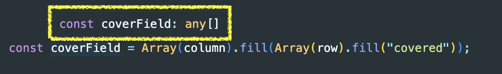

## **문제를 만나다: any[]로 타입이 결정되는 상황**


타입스크립트를 이용해서 2차 배열을 만들던 중, Array.fill() 을 이용하여 생성시 분명 “covered” 라는 문자열 요소값을 주었음에도 불구하고 최종 타입이 any[ ] 로 결정되는 현상을 발견했습니다.

심지어 noImplicitAny: true와 같은 엄격한 설정이 활성화된 tsconfig.json에서도 경고 없이 작동합니다.

그렇다면 이것은 타입스크립트에 의해 적법하게(?) any 타입이 된 것이라고 생각할 수 있습니다.

**아래 두 가지 의문을 중심으로 이 문제를 해결해 보려고 합니다.**

> - **왜 Array().fill()은 타입을 추론하지 못하고 any[]가 되는가?**
> - **2차 배열 이상을 생성할 때, 왜 타입 정보가 유지되지 않는가?**

## **의문(1): 왜 Array().fill()은 any[]가 되는가?**

### 1. Array 생성자 함수 타입 알아보기

타입스크립트의 소스 코드에서 Array() 생성자의 타입 정의는 lib.es5.d.ts 에서 확인해 보았습니다.

```tsx
interface ArrayConstructor {
    new (arrayLength?: number): any[];
    new <T>(arrayLength: number): T[];
    new <T>(...items: T[]): T[];
    ...
}
```

Array(length)를 호출할 경우, 타입스크립트는 기본적으로 any[]를 반환하도록 설계되어 있습니다. 즉, 명시적으로 타입 매개변수를 제공하지 않는 한, Array() 생성자는 항상 any[]를 반환합니다.

(💡 **TMI** : 의도적으로 만든 빈 배열(`[ , , ]`)은 타입이 undefined[] 입니다.)

### 2. Array.Fill 메서드 타입 알아보기

타입스크립트에서 Array.prototype.fill() 메서드의 타입 정의는 다음과 같습니다:

```tsx
fill(value: T, start?: number, end?: number): this;
```

여기서 중요한 점은 fill()이 반환 타입을 this로 설정하고 있다는 점입니다.

_즉, 배열의 기존 타입을 그대로 유지하므로, 기본 타입이 any[]라면 fill() 호출 후에도 여전히 any[] 타입으로 유지됩니다._

**결론적으로,**

1.  fill() 의 반환값이 any[] 라는 것은, fill이 적용된 배열의 타입이 any[] 이기 때문입니다.
2.  생성자 함수 Array() 를 통한 배열의 타입이 any[] 인 이유는, 생성시 타입 매개변수를 전달하지 않았기 때문입니다.

```tsx
// 예제 1
const numberArray = Array<number>(3).fill('number') // error! number[] 에 string 값을 할당할 수 없습니다!

// 예제 2
const anyArray = Array(3).fill('string') // 타입 추론 결과: any[];
```

따라서, 타입이 명확한 배열을 생성하고자 한다면 생성자 함수를 사용할 때 타입 매개변수를 지정해야 합니다.

## **의문(2): 2차 배열 이상을 생성할 때, 왜 타입 정보가 유지되지 않는가?**

fill() 메서드를 중첩하여 다차원 배열을 생성하면, 내부 배열의 타입 정보가 외부 배열로 전달되지 않는 문제가 발생합니다.

```tsx
const field = Array(column).fill(Array(row).fill('covered'))

// 바깥 배열의 타입: any[]
// 안쪽 배열의 타입: string[]
```

이 코드에서 내부 배열은 string[] 타입으로 추론되지만, 외부 배열은 any[]로 any 타입이며 1차 배열로 유지됩니다.

타입스크립트는 Array()를 사용할 타입 정보의 전달(chain)이 끊기는 듯한 현상을 볼 수 있습니다.

### field 배열 생성 단계별 타입 확인하기

1. **바깥 배열을 생성:** <br>
   Array() 에 타입 매개변수가 없으므로 반환값은 **any[]** 입니다.

2. **안쪽 배열 생성:** <br>
   마찬가지로 타입 매개변수가 없으므로 **any[]** 입니다.

3. **안쪽 배열에 요소(”covered”) 채워 넣기:** <br>
   any[] 에 “covered” 요소를 채우며 **string[]** 타입이 됩니다.

4. **바깥 배열에 안쪽 배열 채워넣기:** <br>
   any[] 인 바깥 배열에 string[] 을 채워넣습니다. <br>
   하지만 fill 의 동작상 요소로 참조값이 들어갈 시 그 타입을 분석하지 않습니다. 다만 주어진 배열의 타입을 변경하지 않고 this 를 반환합니다. 그렇기 때문에 **any[]** 가 됩니다.

   ```tsx
   const a = ['a']
   const b = ['b']
   const c = [a, b] // 타입 : string[][]
   const d = [a, a] // 타입: string[][]
   console.log(d[0] === d[1]) // true

   const e = Array(2).fill(a) // 타입: any[]
   ```

   <br>

## **해결하기**

이 문제를 해결하려면 명시적으로 타입을 선언해야 합니다.

### 1. 명시적인 타입 선언하기

**배열 변수의 타입을 직접 명시**하는 방식도 가능합니다.

```tsx
// type CoverField = "covered" | "uncovered";

// 2차원 배열 타입을 명시적으로 선언
const coverField: CoverField[][] = Array(5)
	.fill(null)
	.map(() => Array(5).fill('covered'))
```

또는 제네릭을 활용해 배열 생성 시 타입을 지정할 수도 있습니다.

```tsx
const coverField = Array<CoverField[]>(5).fill(Array<CoverField>(5).fill('covered'))
```

**Array<T>()** 의 제네릭 타입을 활용하여 배열 타입을 명시적으로 지정할 수도 있습니다:

```jsx
const coverField = Array<CoverState[]>(column).fill(Array<CoverState>(row).fill("covered"));
```

이 방법은 간단하지만, 내부 배열이 동일한 참조를 공유하는 문제(얕은 복사)가 발생할 수 있으므로 주의가 필요합니다.

### **2. map 사용하기**

fill()을 호출한 배열에 대해 타입을 명시적으로 선언하면, 원하는 타입을 유지할 수 있습니다.

```tsx
*// type CoverField = "covered" | "uncovered";

const coverField = Array(5).fill(null).map(() => Array<CoverField>(5).fill("covered"));
// 타입 추론: CoverField[][]*
```

## **결론**

Array(length).fill("string")의 타입이 any[]가 되는 이유는 타입스크립트에서 Array() 생성자가 기본적으로 any[] 타입을 반환하기 때문입니다.

이와 더불어 fill() 메서드는 배열의 타입을 변경하거나 고정하지 않으므로, 타입이 연결되지 않는 것 처럼 보입니다.

**올바른 타입을 유지하기 위해:**

1. **명시적으로 타입을 선언**하거나,

2. map() **메서드를 활용하여 내부 배열을 개별적으로 생성**해야 합니다.

이 방법을 통해 다차원 배열에서도 원하는 타입 정보를 유지할 수 있습니다.

## **참고 자료**

- [TypeScript Handbook](https://www.typescriptlang.org/docs/handbook/intro.html)
- [MDN: Array.prototype.fill()](https://developer.mozilla.org/en-US/docs/Web/JavaScript/Reference/Global_Objects/Array/fill)
